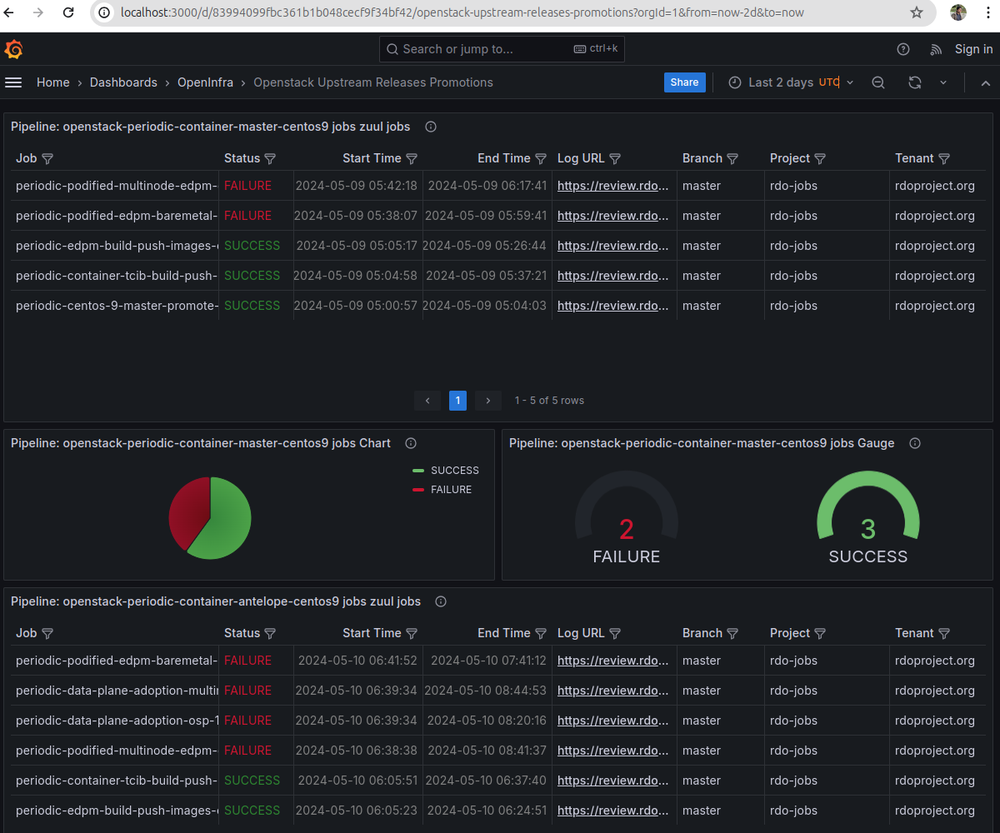

# Grafana & Grafonnet

## Grafana environment

We have prepared a simple [docker-compose.yml](./docker-compose.yml) file that contains a Grafana image.

We have some volumes mapped:

- [datasource.yml](./config/provisioning/datasources/datasource.yml): We have an opensearch datasource configured via provisioning. It contains real upstream public information about some Centos 9 openstack pipelines with several jobs.
- [dashboards/OpenInfra/](./config/dashboards/OpenInfra/): We have a folder where all the JSON models that Grafana can understand will be stored. We will also have the `jsonnet` files there.

Set-up:

```bash
docker compose up
```

## Build dashboards with Grafonnet


Requirements:

- jsonnet: [How to Install jsonnet](https://github.com/google/jsonnet?tab=readme-ov-file#packages): We will need to install `jsonnet` configuration language.
- jsonnet-bundler: [How to Install jsonnet-bundler](https://github.com/jsonnet-bundler/jsonnet-bundler?tab=readme-ov-file#install): We will also need the jsonnet package manager for being able to install `grafonnet`.

### Install grafonnet locally

```bash
$ jb --help
usage: jb [<flags>] <command> [<args> ...]

A jsonnet package manager
...

# Initialize a new empty jsonnetfile
$ jb init

# The file has been created
$ cat jsonnetfile.json
{
  "version": 1,
  "dependencies": [],
  "legacyImports": true
}

# Install grafonnet library
$ jb install github.com/grafana/grafonnet/gen/grafonnet-latest@main
GET https://github.com/grafana/grafonnet/archive/1c56af39815c4903e47c27194444456f005f65df.tar.gz 200
GET https://github.com/grafana/grafonnet/archive/1c56af39815c4903e47c27194444456f005f65df.tar.gz 200
GET https://github.com/jsonnet-libs/docsonnet/archive/6ac6c69685b8c29c54515448eaca583da2d88150.tar.gz 200
GET https://github.com/jsonnet-libs/xtd/archive/63d430b69a95741061c2f7fc9d84b1a778511d9c.tar.gz 200

$ l vendor
total 12K
drwxrwxr-x 4 afuscoar afuscoar 4,0K may  9 18:53 github.com
lrwxrwxrwx 1 afuscoar afuscoar   27 may  9 18:53 xtd -> github.com/jsonnet-libs/xtd
lrwxrwxrwx 1 afuscoar afuscoar   50 may  9 18:53 grafonnet-v10.4.0 -> github.com/grafana/grafonnet/gen/grafonnet-v10.4.0
lrwxrwxrwx 1 afuscoar afuscoar   49 may  9 18:53 grafonnet-latest -> github.com/grafana/grafonnet/gen/grafonnet-latest
lrwxrwxrwx 1 afuscoar afuscoar   42 may  9 18:53 doc-util -> github.com/jsonnet-libs/docsonnet/doc-util
```

Once we have everything installed and our `vendor` folder with the dependencies has been created. We can generate the JSON model that Grafana can understand from our `jsonnet` files.

```bash
$ cd config/dashboards/OpenInfra/jsonnet/

# We will see the entire output without erros if all the code is correct
$ jsonnet -J vendor zuul-ci-upstream-openstack-jobs.jsonnet
{
   "description": "List of Zuul Jobs under different upstream Openstack releases promotion pipelines",
...
}

# We can save the JSON model under the `OpenInfra` folder:
$ jsonnet -J vendor zuul-ci-upstream-openstack-jobs.jsonnet > ../zuul-ci-upstream-openstack-jobs.json
```

If we restart our docker compose we will see the dashboard :)



### Docker image with jsonnet, jb & grafonnet

We can use this image to generate the JSON models for Grafana mapping the jsonnet file as a volumen. Just in case you don't wanna install everything on local.

```bash
$ cd jsonnet
# Build docker image that contains jsonnet, grafonnet and jb with the vendor
$ docker build -t jsonnet-image .
# Specify the jsonnet file that we wanna convert into JSON grafana model
$ JSONNET_DASHBOARD_FILE=./zuul-dashboard.jsonnet docker run -e JSONNET_FILE=/jsonnet_file.jsonnet -v
 "$JSONNET_DASHBOARD_FILE":/jsonnet_file.jsonnet jsonnet-image /jsonnet_file.jsonnet
{
   "schemaVersion": 36,
   "time": {
      "from": "now-6h",
      "to": "now"
   },
   "timezone": "utc",
   "title": "My Dashboard"
```
